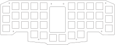

### Cases (Acrylic plates)

### Swtich Plate
1.2mm aluminium, inox, pcb or acrylic

### Upper Middle Plate 
4mm acrylic

### Lower Middle Plate 
3mm acrylic

### Bottom Plate
2mm or 3mm acrylic

                           

### Oled Cover                            
Transparent or smoked acrylic       

