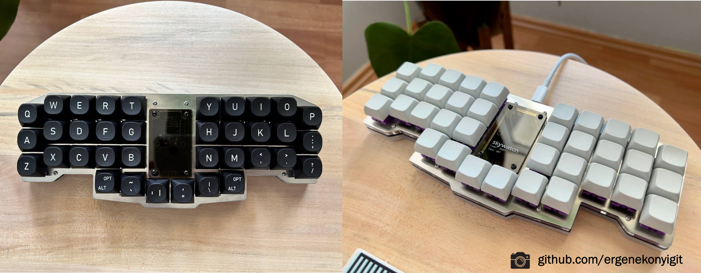
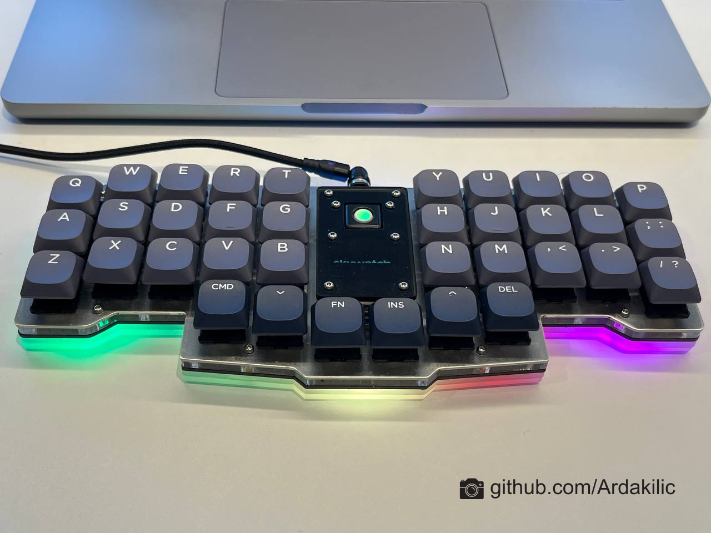
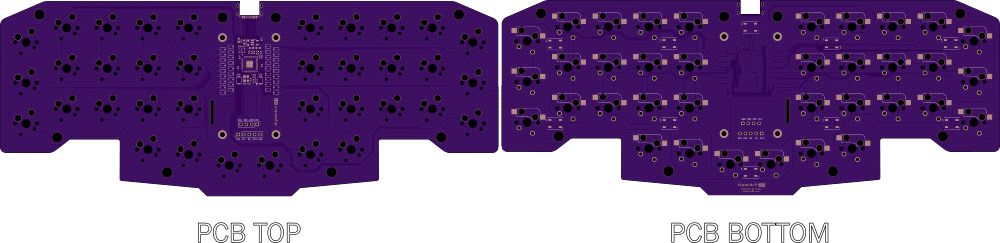
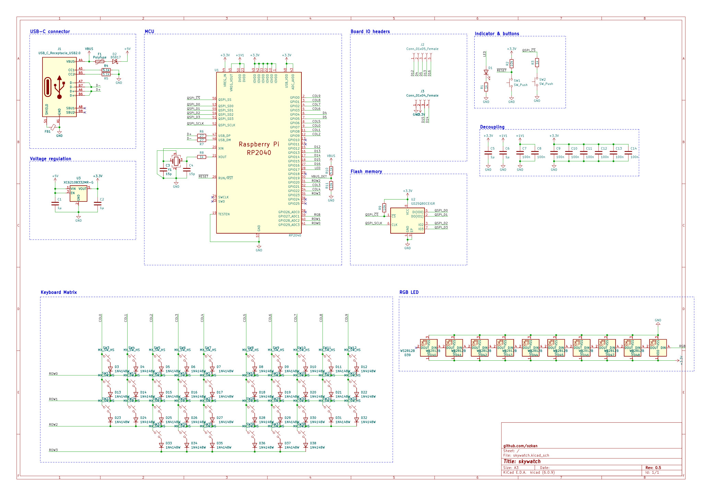

# Skywatch

35% ergonomic ortholinear keyboard, powered by RP2040, along with OLED and hotswap sockets support 

### PCB Renders

### Bill of Materials
| Qty  | Descript                                                               |
|------|------------------------------------------------------------------------|
| 1    | 0.96 inch IIC Serial 4pin OLED Display Module 128X64 (SSD1306)         |
| 36   | Kailh Hot-swappable PCB socket Hot Plug (for MX Switch)                |
| 10   | WS2812B RGB LED Chip 5050SMD                                           |
| 1    | Type-C SMD USB Connectors (LCSC Part #C223906)                         |

### Cases (Acrylic plates)
| Qty  | Descript                                                               |
|------|------------------------------------------------------------------------|
| 1    | [Swtich Plate (1.2mm aluminium, inox or acrylic)](Plate/)              |
| 1    | [Upper Middle Plate (4mm acrylic)](Plate/)                             |
| 1    | [Lower Middle Plate (3mm acrylic)](Plate/)                             |
| 1    | [Bottom Plate (2mm or 3mm acrylic)](Plate/)                            |
| 1    | [Oled Cover (transparent or smoked acrylic)](Plate/)                   |
| 12   | M2x8mm Standoff/Spacer                                                 |
| 24   | M2x6mm Screw                                                           |
| 8    | Silicone Rubber                                                        |

### Features
- Raspberry Pi RP2040 MCU
- 16MB flash memory (depending on component selection and availability)
- User LED & USB VBUS detect
- USB-C mid-mount connector
- Designed to be manufactured and assembled by common PCBA services
- The PCB has Kailh Hot-swappable sockets, so the switches can be swapped.
- 10x addressable (WS2812) underglow RGB led
- 128x64 Oled display 
- Trackball (optional) 

### Schematic

### Firmware
[https://github.com/ozkan/Skywatch-QMK](https://github.com/ozkan/Skywatch-QMK)

### Finding Help

Have questions or need help, reach out via [our Telegram group](https://t.me/mechistanbul) where you will find many helpful Skywatch owners.

### Credits
- The design of this keyboard is based on the `0xB2 - splinky` board. Thanks [plut0nium](https://github.com/plut0nium)  
- Huge shoutout to [Arda Kılıçdağı ](https://github.com/Ardakilic) for tons of advice and help.

### License
[MIT License](LICENSE)
